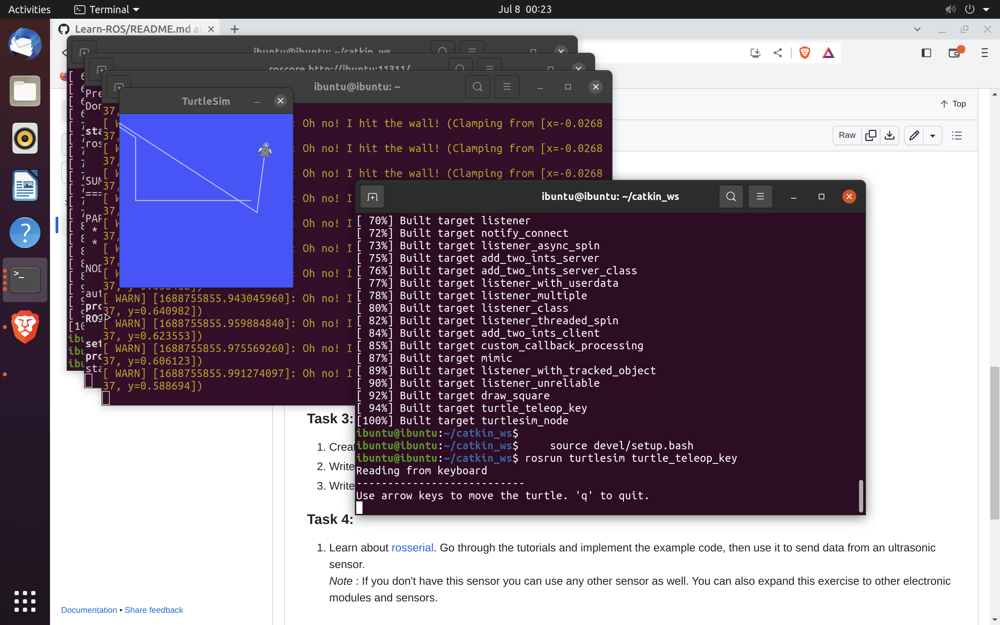

**TASK 1**
* Creating a catkin workspace  (1.1)
```
    mkdir -p catkin_ws/src  
    cd catkin_ws  
    catkin_make  

    source devel/setup.bash  
```  

* Creating a ROS package  (1.2)
```
    cd catkin_ws/src  
    catkin_create_pkg beginner_tutorials std_msgs rospy roscpp  

    cd catkin_ws
    catkin_make

    source devel/setup.bash
```  

* Running turtlesim  (1.3)
```
    roscore  
    rosrun turtlesim turtlesim_node  
    rosrun turtlesim turtle_teleop_key
```
**Turtle-bot with teleop key**  
* Output



**Talker-Listener example**  (1.4)
* Codes for python
  
```
cd catkin_ws/src
catkin_create_pkg beginner_tutorials std_msgs rospy roscpp
nano beginner_tutorials/src/talker.py

```

* Code for talker.py
```
    #!/usr/bin/env python

import rospy
from std_msgs.msg import String

def talker():
    pub = rospy.Publisher('chatter', String, queue_size=10)
    rospy.init_node('talker', anonymous=True)
    rate = rospy.Rate(10)  # 10 Hz

    while not rospy.is_shutdown():
        message = "Hello, ROS!"
        rospy.loginfo(message)
        pub.publish(message)
        rate.sleep()

if __name__ == '__main__':
    try:
        talker()
    except rospy.ROSInterruptException:
        pass
chmod +x beginner_tutorials/src/talker.py

```
* Code
  
```
nano beginner_tutorials/src/listener.py


```

* Code for listener.py
```
#!/usr/bin/env python

import rospy
from std_msgs.msg import String

def callback(data):
    rospy.loginfo("I heard: %s", data.data)

def listener():
    rospy.init_node('listener', anonymous=True)
    rospy.Subscriber('chatter', String, callback)
    rospy.spin()

if __name__ == '__main__':
    listener()

chmod +x beginner_tutorials/src/listener.py

```

* Output


**TASK 2**
* Codes for c++ (2.1)
  
```
cd beginner_tutorials/src
touch talker.cpp
touch listener.cpp
```
```
cd ~/catkin_ws
catkin_make
source devel/setup.bash
rospack find beginner_tutorials
rosrun beginner_tutorials talker
rosrun beginner_tutorials listener

```

* Code for talker.cpp
```
 #include "ros/ros.h"
#include "std_msgs/String.h"

int main(int argc, char** argv)
{
    ros::init(argc, argv, "talker");
    ros::NodeHandle nh;
    ros::Publisher pub = nh.advertise<std_msgs::String>("chatter", 10);
    ros::Rate rate(10);  // 10 Hz

    while (ros::ok())
    {
        std_msgs::String message;
        message.data = "Hello, ROS!";
        ROS_INFO("%s", message.data.c_str());
        pub.publish(message);
        rate.sleep();
    }

    return 0;
}

```
* Code for listener.cpp
```
#include "ros/ros.h"
#include "std_msgs/String.h"

void callback(const std_msgs::String::ConstPtr& msg)
{
    ROS_INFO("I heard: %s", msg->data.c_str());
}

int main(int argc, char** argv)
{
    ros::init(argc, argv, "listener");
    ros::NodeHandle nh;
    ros::Subscriber sub = nh.subscribe("chatter", 10, callback);
    ros::spin();

    return 0;
}

```

* Output


* Codes for int, bool and char (2.2)
* talker.py:
  
```
#!/usr/bin/env python

import rospy
from std_msgs.msg import Int32, Bool, Char

def talker():
    pub_int = rospy.Publisher('chatter_int', Int32, queue_size=10)
    pub_bool = rospy.Publisher('chatter_bool', Bool, queue_size=10)
    pub_char = rospy.Publisher('chatter_char', Char, queue_size=10)
    rospy.init_node('talker', anonymous=True)
    rate = rospy.Rate(10)  # 10 Hz

    while not rospy.is_shutdown():
        number = 42
        flag = True
        letter = 'A'
        rospy.loginfo("Publishing: number={}, flag={}, letter={}".format(number, flag, letter))
        pub_int.publish(number)
        pub_bool.publish(flag)
        pub_char.publish(letter)
        rate.sleep()

if __name__ == '__main__':
    try:
        talker()
    except rospy.ROSInterruptException:
        pass

```

* listener.py
```
#!/usr/bin/env python

import rospy
from std_msgs.msg import Int32, Bool, Char

def int_callback(data):
    rospy.loginfo("Received int: {}".format(data.data))

def bool_callback(data):
    rospy.loginfo("Received bool: {}".format(data.data))

def char_callback(data):
    rospy.loginfo("Received char: {}".format(data.data))

def listener():
    rospy.init_node('listener', anonymous=True)
    rospy.Subscriber('chatter_int', Int32, int_callback)
    rospy.Subscriber('chatter_bool', Bool, bool_callback)
    rospy.Subscriber('chatter_char', Char, char_callback)
    rospy.spin()

if __name__ == '__main__':
    listener()

```
* Output


